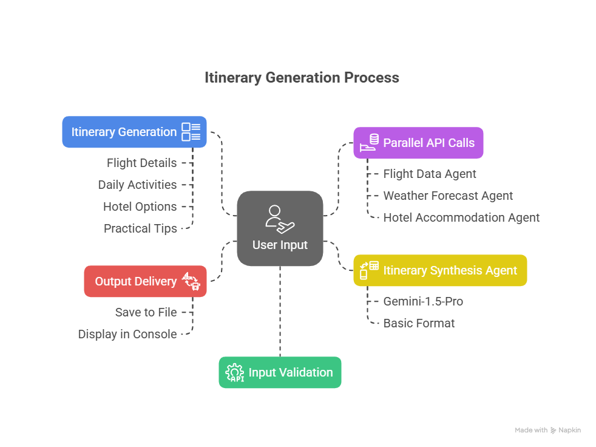
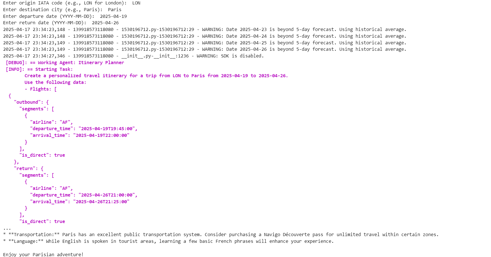

# AI-Travel-Assistant

## Project Overview

The **AI Travel Assistant** is an advanced, modular system designed to deliver personalized travel itineraries by leveraging autonomous agents that interface with external APIs. This tool streamlines the travel planning process by retrieving real-time data on **flights**, **weather forecasts**, and **hotel accommodations**, then synthesizing this information into a cohesive and tailored itinerary.

Ideal for travelers seeking a seamless planning experience, the assistant provides recommendations for:
- Flights
- Daily activities based on weather conditions
- Accommodation options across various budget ranges

---

## Project Objectives

The primary objective of the AI Travel Assistant is to **automate and enhance** the travel planning experience by integrating multiple data sources into a unified itinerary.

- Employs a **modular architecture** where each component functions independently
- Produces practical, **destination-specific recommendations**
- Accounts for weather, budget, and logistics
- Ensures a **user-friendly and efficient** planning process

---

## System Architecture and Workflow

The AI Travel Assistant operates through a coordinated workflow involving **four specialized agents**:

### 1. User Input Acquisition
Users provide:
- **Origin** (IATA code, e.g., `LON`)
- **Destination city** (e.g., `Paris`)
- **Departure date** (`YYYY-MM-DD`)
- **Return date** (`YYYY-MM-DD`)

All inputs are validated for compatibility with APIs.

---

### 2. Flight Data Agent
- **Objective**: Retrieve flight options.
- **Process**: Queries a flight search API for:
  - Airline names
  - Departure/arrival times
  - Flight duration and type (direct/connecting)
  - Pricing
- **Output**: JSON list of flight options (prioritizes 14:45 departure).
- **Error Handling**: Returns error message on failed API requests.

---

### 3. Weather Forecast Agent
- **Objective**: Fetch daily weather forecasts.
- **Process**: Uses a weather API to retrieve:
  - Temperature
  - Conditions (e.g., sunny, rainy)
  - Notes for historical averages if applicable
- **Output**: JSON array of daily summaries.
- **Error Handling**: Returns error for failed requests or unknown locations.

---

### 4. Hotel Accommodation Agent
- **Objective**: Identify accommodations.
- **Process**: Queries a hotel booking API to fetch:
  - Hotel names
  - Star ratings
  - Pricing & availability
- **Categories**:
  - **Budget**: < €150/night
  - **Mid-range**: €150–€300/night
  - **Luxury**: > €300/night (4+ stars prioritized)
- **Output**: JSON with up to two hotels per category.
- **Error Handling**: Returns error on API failure.

---

### 5. Itinerary Synthesis Agent
- **Objective**: Compile the final itinerary.
- **Process**:
  - Uses **Gemini-1.5-Pro** (via LangChain) if a Google API key is available.
  - **Fallback**: Uses a basic template with predefined activities.

- **Structure**:
  - **Overview**: Summary of flights and weather
  - **Daily Plan**: Activities tailored to weather
  - **Hotel Recommendations**: One per category
  - **Notes**: Travel tips, packing advice

- **Output**:
  - Saved as `itinerary_[origin]_to_[destination]_[start_date]_to_[end_date].txt`
  - Also displayed in the console
- **Error Handling**: Reverts to basic formatting if AI fails

---

*Figure: Diagram illustrating the operational workflow of the AI Travel Assistant, depicting the interaction of user inputs with the Flight, Weather, Hotel, and Itinerary Synthesis Agents to produce a personalized itinerary.*

---

## Implementation Details

### Modular Agent Framework
- Built using **Python** and **CrewAI**
- Each agent handles a specific task:
  - Flights
  - Weather
  - Hotels
  - Itinerary Synthesis

### External API Integration
- **Flight API**: Prioritizes direct flights and specific times
- **Weather API**: Uses real-time or historical data
- **Hotel API**: Sorts by price & rating
- **Tenacity**: Used for retrying failed API requests

### AI-Driven Itinerary Generation
- **LangChain + Gemini-1.5-Pro** used for natural, polished output
- Fallback logic ensures itinerary generation without AI model access

### Error Handling and Logging
- Comprehensive API error handling
- Logged using Python's `logging` module
- Graceful fallback to basic outputs

### User Interface
- CLI-based input system
- Validates all inputs for API compatibility

### System Testing and Validation
- Example: London to Paris (April 19–26, 2025)
  - Flights: Accurate and priced correctly
  - Weather: Forecasts aligned with expectations
  - Hotels: Properly categorized
  - Itinerary: Clear, weather-based, and travel-relevant

---

## Outputs
- 📄 Text file: `itinerary_LON_to_PAR_2025-04-19_to_2025-04-26.txt`
- 💬 Console display: Complete itinerary

---

*Figure: The screenshot should display a sample itinerary (e.g., for a trip from London to Paris), either from the console output or the saved text file, highlighting the clear, organized layout with details like flight information, weather-based activities, and hotel suggestions.*

---

## Usage Guidelines

To use the AI Travel Assistant:

1. **Launch** the application via a **Jupyter Notebook** or **Python terminal**.
2. **Enter required travel details**:
   - **Origin IATA code** (e.g., `LON` for London)
   - **Destination city** (e.g., `Paris`)
   - **Departure and return dates** in `YYYY-MM-DD` format
3. The system will:
   - Retrieve **flight options**, **weather forecasts**, and **hotel recommendations**
   - Generate a **personalized itinerary**
   - Save the itinerary as a **text file**
   - Display the itinerary in the **console**
4. **Review the itinerary** for:
   - Flight details
   - Weather-based daily activity suggestions
   - Hotel options across price ranges
   - Practical travel tips and advice

---

## Potential Enhancements

To improve the AI Travel Assistant further, consider the following feature expansions:

- **Expanded API Integration**: Add support for APIs that provide:
  - Local attractions and activities
  - Dining and restaurant recommendations
  - Local transportation options

- **Customizable User Preferences**:
  - Allow users to set **budget limits**
  - Let users select **preferred activity types** (e.g., outdoor, cultural, relaxation)

- **Graphical User Interface (GUI)**:
  - Build a web or desktop interface to improve usability and accessibility

- **Multi-Destination Support**:
  - Handle **multi-city** itineraries
  - Coordinate complex **flight and accommodation** logistics

---

## Contribution Guidelines

Contributions are welcome and encouraged!

To contribute:

1. **Fork** the repository.
2. **Create a new branch** for your feature or fix.
3. **Submit a pull request** with your changes.

Please ensure that:

- New features follow the **modular architecture**.
- Code includes **robust error handling**.
- All updates are accompanied by **clear documentation** and comments.
- The system remains **extensible** and easy to maintain.

